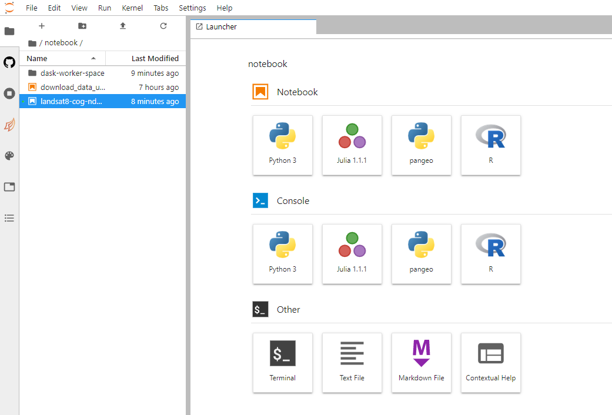

# jupyterhub-nird-toolkit

[Docker image](https://hub.docker.com/r/nordicesmhub/climate-nird-toolkit) for Jupyterhub [pangeo](http://pangeo.io/) NIRD toolkit.

## Getting access

We are maintaining a Jupyterhub instance called [https://climate.uiogeo-apps.sigma2.no/](https://climate.uiogeo-apps.sigma2.no/) as part of [EOSC-Nordic](https://www.eosc-nordic.eu/). From this instance, you can access all CMIP data maintained by Norway.

Access can be granted on demand for all researchers working in the Nordics. Please fill an [issue](https://github.com/NordicESMhub/jupyterhub-nird-toolkit/issues/new); make sure you explain (shortly) what project you are working on.

## Activate pangeo conda environment in the jupyterhub

Open a terminal in the Jupyterhub:

```
source activate pangeo
python -m ipykernel install --user --name=pangeo
```

Then restart your server to see pangeo environment (as shown on the figure below).



## Pangeo software stack

```
source activate pangeo
python -m ipykernel install --user --name=pangeo
```


Also when you open a notebook, make sure to select **pangeo** for the kernel.


## Examples of Notebooks

- Examples of data processing can be found [here](https://nordicesmhub.github.io/Norway_Sweden_training/intro).
- Feel free to [contact us](https://github.com/NordicESMhub/jupyterhub-nird-toolkit/issues/new) to add new resources/examples.
